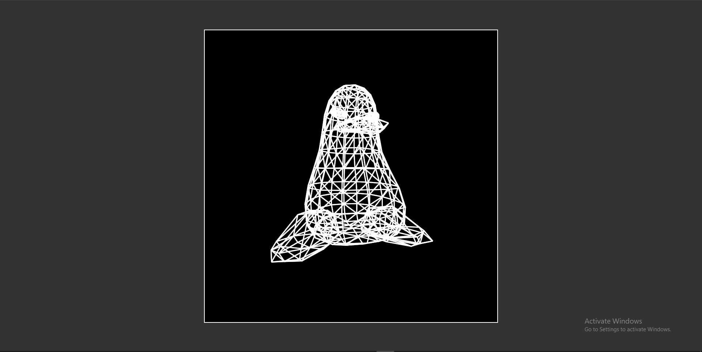

# One Formula That Demystifies 3D Graphics

[](https://tsoding.github.io/formula/)

This repository contains a simple, from-scratch implementation of a 3D perspective projection engine using pure JavaScript and HTML Canvas. It is based on a single mathematical formula and was inspired by the work of Tsoding.

_Big shoutout to [Tsoding](https://www.youtube.com/@TsodingDaily)._

## Video Source

Watch the original explanation here:
[](https://www.youtube.com/watch?v=qjWkNZ0SXfo)

## Quick Start (Run Locally)

```console
$git clone [https://github.com/ZIYAD-MOHAMID/3D_Flash_Point.git$](https://github.com/ZIYAD-MOHAMID/3D_Flash_Point.git$) cd formula
$ # Open the index.html file in your preferred web browser.
```
